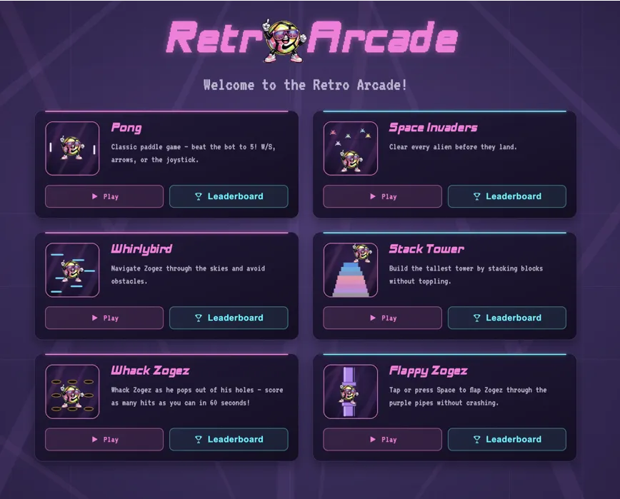

# Retro Arcade



A web + mobile (PWA) arcade of small retro mini games — Pong, Space Invaders,
Whirlybird, Stack Tower, Whack Zogez, Flappy Zogez — with per-game
leaderboards. Games run on `<canvas>` via [kaplay](https://kaplayjs.com/),
wrapped in a React + React Router shell.

## Getting started

```bash
npm install
cp .env.example .env   # fill in your Supabase project's URL + anon key
npm run dev
```

## Scripts

- `npm run dev` — start the dev server
- `npm run build` — typecheck + production build
- `npm run test` — run tests (Vitest)
- `npm run lint` — run ESLint
- `npm run typecheck` — TypeScript check only

## Project structure

See [AGENTS.md](./AGENTS.md) for the project structure and contribution
guidelines.
